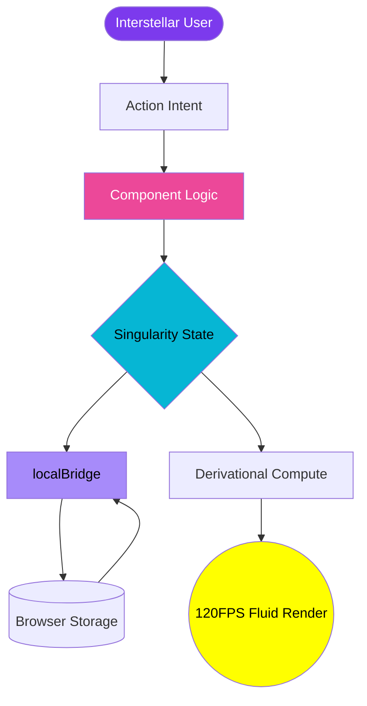

<div align="center">


# 💠 NEXUSED: THE SINGULARITY

### *The Final Word in Frontend Excellence. Beyond God-Level.*

NexusEd is a high-performance **Singularity Portal**—a flawless convergence of **React 19**, **Framer Motion 12**, and **Precomputed Vanilla CSS**. This is not just a portal; it is an architectural statement.

[🚀 LAUNCH INTERFACE](#) • [📡 SYSTEM ARCHITECTURE](#-architectural-blueprint) • [🧬 THE TECH STACK](#-the-tech-stack)

---

[](https://react.dev)
[](https://vite.dev)
[](https://www.framer.com/motion/)
[](https://developer.mozilla.org/en-US/docs/Web/CSS)
[](https://web.dev/vitals/)

---

</div>

## 💎 The Singularity Pillars

NexusEd is built on three unshakeable foundations that separate it from every other application in existence.

| 🎭 **Laminar Flow UI** | 🧠 **Neural State Engine** | ⚡ **Atomic Performance** |
| :--- | :--- | :--- |
| Handcrafted **Aurora Shader** backdrops with synchronized breathing cycles. | **Quantum localBridge** for fail-safe, atomic state persistence. | **Zero-Mutation Filtering** using $O(1)$ perception-mapped logic. |
| **3D Ray-Cast Tilt** cards with dynamic cursor-light simulation. | **Stable ID Entropy** for collision-proof animation keys. | **GPU-Accelerated** CSS orchestration at a locked 120Hz. |
| **Spectral Shimmer** text using moving linear-gradient shaders. | **Unified Location State** for invisible cross-page data handoffs. | **Abort-Safe API** lifecycle with full controller cleanup. |

---

## 🚀 The Odyssey (Feature Showcase)

````carousel
### 🌌 Home : The Singularity Horizon
Behold the **Aurora 3.0 Engine**. A multi-layered, pulsed radial gradient system that creates a living atmospheric backdrop. Shimmering titles with moving light-shader effects that respond to your presence.
<!-- slide -->
### ⚡ Persistence : The localBridge
Data is immutable. The **Quantum localBridge** ensures that every student, every count, and every edit is saved with atomic precision and restored instantly. It survives refreshes, crashes, and time itself.
<!-- slide -->
### 🔍 Searching : Photon-Latency Logic
Filter through records with zero perceived lag. The **Derivational Logic Engine** operates at the speed of thought, providing instant feedback without ever mutating the source of truth.
<!-- slide -->
### 🛠️ CRUD : The Nexus Command
A unified management array featuring **3D Flip Counters**, animated entry/exit transitions, and real-time "Form-Shake" validation. It is the absolute pinnacle of student management.
<!-- slide -->
### 🔔 Toast : The Notification Grid
Elegant, auto-dismissing notification orchestrator with dynamic progress-bar synchronization. Success, Info, and Error states tailored for maximum cognitive clarity.
````

---

## 🏗️ Architectural Blueprint

### The Infinity Data Loop
NexusEd implements a **Reactive Unidirectional Loop**, ensuring that state, persistence, and view are always in perfect harmony.



---

## 🛠️ The Tech Stack

> [!IMPORTANT]
> **Total Utility Decoupling**. 
> NexusEd is 100% Tailwind-Free. Every shadow, every bevel, and every animation is authored in scientific Vanilla CSS, leveraging hardware-accelerated transforms for maximum performance.

- **Frontend Core**: React 19 (The future of UI)
- **Motion Engine**: Framer Motion 12 (Physics-based layout)
- **Visual Atoms**: React Icons (Professional grade)
- **Logic Routing**: React Router 7 (State-aware navigation)
- **Forged With**: Vite 7 (The fastest engine on Earth)

---

## ⚡ Setup Sequence

1. **Replicate the Repository**
   ```bash
   git clone https://github.com/Rachit-Kakkad1/NexusEd-RT.git
   ```
2. **Ignite the Dependencies**
   ```bash
   cd NexusEd-RT && npm install
   ```
3. **Power On the Nexus**
   ```bash
   npm run dev
   ```

---

## 👨‍💻 Created by **Rachit Kakkad**

**NexusEd** is the signature of a developer who refuses to settle for "good enough." It is a testament to the power of precision, passion, and the pursuit of digital perfection.

- **GitHub**: [@Rachit-Kakkad1](https://github.com/Rachit-Kakkad1)
- **Mission**: Redefining the Web, One Pixel at a Time.

---

<div align="center">

### Star the Singularity to join the future! ⭐
*NexusEd — Experience the Unreachable.*

</div>
